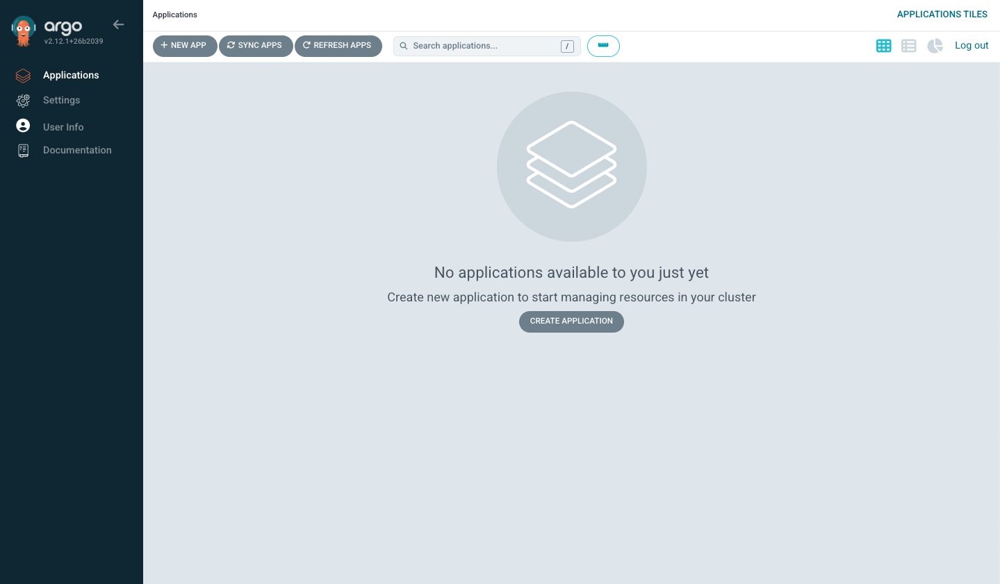

# argocd-training
Repository that holds the contents for an ArgoCD training.

# Steps for the training!
1. Start the dev container, which can be done in 2 ways:

   * Open GitHub, clone this repo with one of the following commands:
     ```bash
     # https
     git clone https://github.com/fullstaq-labs/argocd-training.git
     
     # ssh
     git clone git@github.com:fullstaq-labs/argocd-training.git
     ```
     Open the folder where you've cloned the repo locally in Visual Studio Code and follow the instructions from the image below.\
     
   * Go to [this Repo](https://github.com/fullstaq-labs/argocd-training) in GitHub and open Codespaces (follow the instructions from the image below).\
     

    > [!IMPORTANT]
    > If you've used the GitHub Codespaces, be sure to close the codespace after the training.\
    > Otherwise you could be billed by GitHub for the use of Codespaces

2.  When the devcontainer starts a cluster is created and ArgoCD is already installed.\
    Normally when you install ArgoCD there are two options:\
        * Based on manifests (manifests can be found [here](https://raw.githubusercontent.com/argoproj/argo-cd/stable/manifests/install.yaml))\
        * Based on a helm chart (helm charts can be found [here](https://artifacthub.io/packages/helm/argo/argocd-apps))\
    In the devcontainer it's installed based on the helm chart.

3.  First thing that you may do is test if ArgoCD is deployed correctly.\
    Let's check if all pods are running be executing the following commands:
    ```bash
    # Select the correct namespace
    kns argocd

    # Check if all pods are running
    kubectl get pods
    ```

4.  If all pods are in the Running state we can proceed.\
    Now let's check if you can reach the ArgoCD.\
    This can be done from the Tab ports, which is shown in the picture below.\
    In there press on the marked button, which will open a browser window.\
    

    You can login with username **admin** and password **admin**.\
    Once there you should see the following content:
    

5.  The UI is one way to interact with ArgoCD.\
    Another way is the ArgoCD CLI tool, which could be handy when you need to do some debugging.\
    To use the CLI tool you should login with the same credentials (username **admin** and password **admin**).
    Follow the commands below to start:
    ```bash
    # ArgoCD login command
    argocd login localhost:31443
    ```
    > [!NOTE]
    > It will show a certificate erro (unknown authority), you can proceed insecurely.

    To see all posibilities of the CLI tool just type the following command:
    ```bash
    argocd
    ```

    This should print the following output in your terminal:
    ```console
    argocd controls a Argo CD server

    Usage:
    argocd [flags]
    argocd [command]

    Available Commands:
    account     Manage account settings
    admin       Contains a set of commands useful for Argo CD administrators and requires direct Kubernetes access
    app         Manage applications
    appset      Manage ApplicationSets
    cert        Manage repository certificates and SSH known hosts entries
    cluster     Manage cluster credentials
    completion  output shell completion code for the specified shell (bash, zsh or fish)
    context     Switch between contexts
    gpg         Manage GPG keys used for signature verification
    help        Help about any command
    login       Log in to Argo CD
    logout      Log out from Argo CD
    proj        Manage projects
    relogin     Refresh an expired authenticate token
    repo        Manage repository connection parameters
    repocreds   Manage repository connection parameters
    version     Print version information

    Flags:
        --auth-token string               Authentication token
        --client-crt string               Client certificate file
        --client-crt-key string           Client certificate key file
        --config string                   Path to Argo CD config (default "/home/vscode/.config/argocd/config")
        --controller-name string          Name of the Argo CD Application controller; set this or the ARGOCD_APPLICATION_CONTROLLER_NAME environment variable when the controller's name label differs from the default, for example when installing via the Helm chart (default "argocd-application-controller")
        --core                            If set to true then CLI talks directly to Kubernetes instead of talking to Argo CD API server
        --grpc-web                        Enables gRPC-web protocol. Useful if Argo CD server is behind proxy which does not support HTTP2.
        --grpc-web-root-path string       Enables gRPC-web protocol. Useful if Argo CD server is behind proxy which does not support HTTP2. Set web root.
    -H, --header strings                  Sets additional header to all requests made by Argo CD CLI. (Can be repeated multiple times to add multiple headers, also supports comma separated headers)
    -h, --help                            help for argocd
        --http-retry-max int              Maximum number of retries to establish http connection to Argo CD server
        --insecure                        Skip server certificate and domain verification
        --kube-context string             Directs the command to the given kube-context
        --logformat string                Set the logging format. One of: text|json (default "text")
        --loglevel string                 Set the logging level. One of: debug|info|warn|error (default "info")
        --plaintext                       Disable TLS
        --port-forward                    Connect to a random argocd-server port using port forwarding
        --port-forward-namespace string   Namespace name which should be used for port forwarding
        --redis-haproxy-name string       Name of the Redis HA Proxy; set this or the ARGOCD_REDIS_HAPROXY_NAME environment variable when the HA Proxy's name label differs from the default, for example when installing via the Helm chart (default "argocd-redis-ha-haproxy")
        --redis-name string               Name of the Redis deployment; set this or the ARGOCD_REDIS_NAME environment variable when the Redis's name label differs from the default, for example when installing via the Helm chart (default "argocd-redis")
        --repo-server-name string         Name of the Argo CD Repo server; set this or the ARGOCD_REPO_SERVER_NAME environment variable when the server's name label differs from the default, for example when installing via the Helm chart (default "argocd-repo-server")
        --server string                   Argo CD server address
        --server-crt string               Server certificate file
        --server-name string              Name of the Argo CD API server; set this or the ARGOCD_SERVER_NAME environment variable when the server's name label differs from the default, for example when installing via the Helm chart (default "argocd-server")

    Use "argocd [command] --help" for more information about a command.
    ```

6.  Now we've explored the ways to interact, let's start with deploying stuff.\
    There are some core components in ArgoCD, which are very important:\
    * Cluster - Defines the cluster and provides credentials to interact with the cluster (provided as a Kubernetes secret with annotations);
    * Repository - Defines the repository credentials for repositories where Kubernetes resources can be deployed from  (provided as a Kubernetes secret with annotations);
    * AppProjects - Defines a project in which you can deploy resources. Within an AppProject you can define certain boundries (provided as a CRD);
    * Application - Defines a single application, which can be helm charts, multiple manifests, et cetera (provided as a CRD);
    * ApplicationSet - Defines a set of applications, which can be helm charts, multiple manifests, et cetera (provided as a CRD).

    Let's start with a simple example, we will deploy an App using the ArgoCD CLI.\
    Use the command below to deploy a simple guestbook app:

    ```bash
    argocd app create guestbook --repo https://github.com/argoproj/argocd-example-apps.git --path guestbook --dest-namespace default --dest-server https://kubernetes.default.svc --directory-recurse
    ```

    But what did we deploy? Let's breakdown the command
    * We've deployed an app called *guestbook* (defined by providing a name after the create command);
    * It's based on the contents of repository *https://github.com/argoproj/argocd-example-apps.git* (defined by --repo);
    * Within that repository we are looking for the path *guestbook* (defined by --path);
    * It will be deployed in namespace *default* (defined by --dest-namespace);
    * It will be deployed to cluster *https://kubernetes.default.svc* (defined by --dest-server);
    * It will look through the whole directory (defined by --directory-recurse).

    When this app is deployed, it isn't synchronized.\
    You can confirm this in two ways:
    1. Check the UI;
    2. Use the ArgoCD CLI.
    ```bash
    argocd app list
    ```
    ```console
    # The result:
    NAME              CLUSTER                         NAMESPACE  PROJECT  STATUS     HEALTH   SYNCPOLICY  CONDITIONS  REPO                                                 PATH       TARGET
    argocd/guestbook  https://kubernetes.default.svc  default    default  OutOfSync  Missing  Manual      <none>      https://github.com/argoproj/argocd-example-apps.git  guestbook  
    ```

    Synchronizing the application can also be done in two ways.\
    1. Go to the UI and press the synchronize button.
    2. Use the ArgoCD CLI.
    ```bash
    argocd app sync argocd/guestbook
    ```

7.  That's one way to deploy an application, but this is off course not what we want.\
    Because what happens if the cluster breaks and there is no decent back-up of ETCD?!\
    Then all our changes are lost :(\
    This is where the power of GitOps comes in (more on GitOps can be found [here](https://argo-cd.readthedocs.io/en/stable/#how-it-works)).\


    Additional text

    ## To Do
    * Create GitHub repo with manifests which can be forked
    * Add Repo to Argocd
    * Create Application based on manifests (GitOps way)
    * Create application based on helm charts (GitOps way)
    * Manage ArgoCD with ArgoCD (GitOps way)
    * Create AppProject
    * Create another application in the other project (GitOps way)
    
    ## Advanced exercises
    * Create multiple users;
    * Create OIDC integration;

